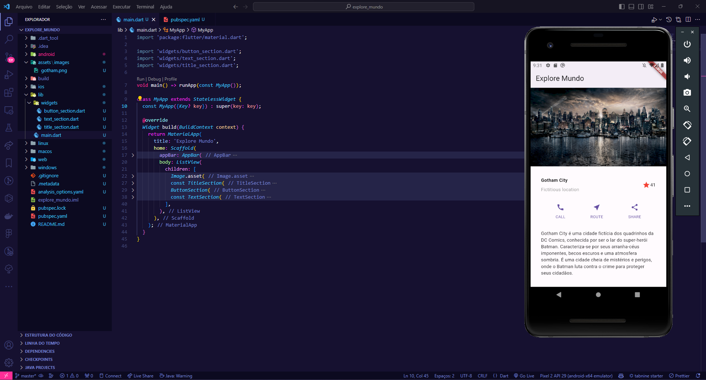

# Nivel 2, Mundo 4 - DESENVOLVIMENTO FULLSTACK

## Microatividades

## Missão Prática | Vamos Criar um App!

- **Descrição**: Essa missão me ensinou a organizar e dividir o app, de maneira que fique melhor sua manutenção e leitura.
- **Caminho do Código**: [Explore Mundo](./)
- **Instruções de Execução**: 
  
```
cd explore_mundo
flutter pub get
flutter run
```

### Trabalho rodando:



#

[](./estacio-logo.webp)

## Este trabalho foi realizado por **RICKSON DE OLIVEIRA VIANA**, Matrícula **202205071601**.

*Nota: Antes de executar o projeto, certifique-se de ter o Flutter instalado em sua máquina e de que todas as dependências necessárias estão instaladas. Você também pode precisar de um dispositivo Android ou iOS conectado ou de um emulador configurado. Consulte a documentação do Flutter para mais informações.*